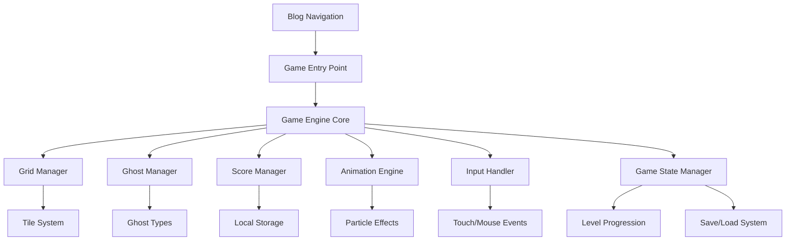

# Design Document

## Overview

The Little Ghost Match-3 game will be implemented as a standalone JavaScript module that integrates with the existing blog platform. The game follows a modular architecture pattern consistent with the current codebase, using vanilla JavaScript with ES6+ features. The design emphasizes performance, mobile responsiveness, and seamless integration with the blog's existing UI/UX patterns.

## Architecture

### High-Level Architecture



### Integration with Existing Blog Platform

The game will be integrated as a new route in the blog's navigation system, following the existing modular JavaScript architecture:

- **Entry Point**: New menu item in the main navigation
- **Routing**: Handled by existing content loader system
- **Styling**: Extends existing CSS with game-specific styles
- **Performance**: Leverages existing performance optimization patterns

## Components and Interfaces

### Core Game Engine (`js/ghost-match3-engine.js`)

```javascript
class GhostMatch3Engine {
    constructor(container, options = {}) {
        this.container = container;
        this.gridSize = options.gridSize || { width: 8, height: 8 };
        this.ghostTypes = options.ghostTypes || 6;
        this.score = 0;
        this.level = 1;
        this.moves = 30;
        
        this.gridManager = new GridManager(this.gridSize);
        this.ghostManager = new GhostManager(this.ghostTypes);
        this.scoreManager = new ScoreManager();
        this.animationEngine = new AnimationEngine();
        this.inputHandler = new InputHandler();
    }
    
    // Core game loop methods
    initialize() { /* Setup game board */ }
    update() { /* Game state updates */ }
    render() { /* Visual rendering */ }
    handleInput(event) { /* Process user input */ }
    checkMatches() { /* Match detection logic */ }
    processMatches(matches) { /* Handle matched tiles */ }
    applyGravity() { /* Tile falling physics */ }
    fillEmptySpaces() { /* Generate new tiles */ }
}
```

### Grid Management System (`js/grid-manager.js`)

```javascript
class GridManager {
    constructor(gridSize) {
        this.width = gridSize.width;
        this.height = gridSize.height;
        this.grid = this.createEmptyGrid();
    }
    
    createEmptyGrid() { /* Initialize 2D array */ }
    getTile(x, y) { /* Get tile at position */ }
    setTile(x, y, ghost) { /* Set tile at position */ }
    swapTiles(pos1, pos2) { /* Swap two tiles */ }
    findMatches() { /* Detect 3+ matches */ }
    removeTiles(positions) { /* Remove matched tiles */ }
    applyGravity() { /* Drop tiles down */ }
    fillFromTop() { /* Add new tiles */ }
}
```

### Ghost Character System (`js/ghost-manager.js`)

```javascript
class GhostManager {
    constructor(ghostTypes) {
        this.ghostTypes = this.initializeGhostTypes(ghostTypes);
        this.specialGhosts = this.initializeSpecialGhosts();
    }
    
    initializeGhostTypes(count) {
        return Array.from({length: count}, (_, i) => ({
            id: i,
            color: this.getGhostColor(i),
            sprite: this.getGhostSprite(i),
            animation: this.getGhostAnimation(i)
        }));
    }
    
    createRandomGhost() { /* Generate random ghost */ }
    createSpecialGhost(type) { /* Create power-up ghost */ }
    getGhostSprite(ghostId) { /* Return sprite data */ }
    animateGhost(ghost, animation) { /* Handle animations */ }
}
```

### Animation and Effects Engine (`js/animation-engine.js`)

```javascript
class AnimationEngine {
    constructor() {
        this.activeAnimations = new Map();
        this.particleSystem = new ParticleSystem();
    }
    
    animateTileSwap(tile1, tile2) { /* Smooth tile swapping */ }
    animateTileRemoval(tiles) { /* Match removal effects */ }
    animateGravity(movements) { /* Falling tile animation */ }
    createParticleEffect(position, type) { /* Particle effects */ }
    updateAnimations(deltaTime) { /* Animation frame updates */ }
}
```

### Input Handling System (`js/input-handler.js`)

```javascript
class InputHandler {
    constructor(gameEngine) {
        this.gameEngine = gameEngine;
        this.touchStartPos = null;
        this.mouseStartPos = null;
        this.isDragging = false;
    }
    
    setupEventListeners() {
        // Mouse events for desktop
        this.setupMouseEvents();
        // Touch events for mobile
        this.setupTouchEvents();
        // Keyboard events for accessibility
        this.setupKeyboardEvents();
    }
    
    handleTileSelection(position) { /* Process tile clicks */ }
    handleSwipeGesture(startPos, endPos) { /* Process swipe */ }
    validateMove(from, to) { /* Check if move is valid */ }
}
```

## Data Models

### Game State Model

```javascript
const GameState = {
    grid: Array(8).fill().map(() => Array(8).fill(null)),
    score: 0,
    level: 1,
    moves: 30,
    timeElapsed: 0,
    isGameActive: true,
    selectedTile: null,
    animations: [],
    powerUps: [],
    highScore: 0
};
```

### Ghost Tile Model

```javascript
const GhostTile = {
    id: 'unique-id',
    type: 0, // 0-5 for regular ghosts, 6+ for special
    position: { x: 0, y: 0 },
    isSpecial: false,
    specialType: null, // 'row-clear', 'column-clear', 'bomb'
    animation: null,
    isMatched: false,
    isFalling: false
};
```

### Score and Progress Model

```javascript
const ScoreData = {
    currentScore: 0,
    highScore: 0,
    level: 1,
    movesRemaining: 30,
    targetScore: 1000,
    stars: 0, // 0-3 stars based on performance
    achievements: [],
    totalGamesPlayed: 0,
    totalGhostsMatched: 0
};
```

## Error Handling

### Game Error Management

```javascript
class GameErrorHandler {
    static handleGridError(error) {
        console.error('Grid operation failed:', error);
        // Attempt to restore valid grid state
        this.restoreLastValidState();
    }
    
    static handleAnimationError(error) {
        console.error('Animation error:', error);
        // Skip problematic animation and continue
        this.skipCurrentAnimation();
    }
    
    static handleSaveError(error) {
        console.error('Save operation failed:', error);
        // Show user-friendly message
        this.showSaveErrorMessage();
    }
}
```

### Input Validation

- Validate tile positions are within grid bounds
- Ensure only adjacent tiles can be swapped
- Prevent input during animations
- Handle edge cases for touch/mouse events

### State Recovery

- Automatic save of game state every move
- Recovery from corrupted save data
- Fallback to default state if needed
- Error logging for debugging

## Testing Strategy

### Unit Testing

```javascript
// Example test structure
describe('GhostMatch3Engine', () => {
    describe('Match Detection', () => {
        it('should detect horizontal matches of 3', () => {
            // Test horizontal match detection
        });
        
        it('should detect vertical matches of 3', () => {
            // Test vertical match detection
        });
        
        it('should detect L-shaped matches', () => {
            // Test complex match patterns
        });
    });
    
    describe('Grid Operations', () => {
        it('should apply gravity correctly', () => {
            // Test tile falling mechanics
        });
        
        it('should fill empty spaces from top', () => {
            // Test new tile generation
        });
    });
});
```

### Integration Testing

- Test game integration with blog navigation
- Verify responsive behavior across devices
- Test save/load functionality
- Performance testing for smooth animations

### User Acceptance Testing

- Gameplay flow testing
- Mobile touch interaction testing
- Accessibility testing with keyboard navigation
- Cross-browser compatibility testing

### Performance Testing

- Frame rate monitoring during animations
- Memory usage optimization
- Load time measurement
- Battery usage on mobile devices

## Mobile Optimization

### Touch Interface Design

- Minimum touch target size of 44px
- Visual feedback for touch interactions
- Swipe gesture recognition with tolerance
- Prevent accidental touches during animations

### Responsive Grid Scaling

```javascript
class ResponsiveGridScaler {
    calculateOptimalTileSize(screenWidth, screenHeight) {
        const availableWidth = screenWidth * 0.9; // 90% of screen
        const availableHeight = screenHeight * 0.7; // 70% of screen
        
        const tileSize = Math.min(
            availableWidth / this.gridWidth,
            availableHeight / this.gridHeight
        );
        
        return Math.floor(tileSize);
    }
}
```

### Performance Considerations

- Use CSS transforms for smooth animations
- Implement object pooling for particles
- Lazy load game assets
- Optimize sprite sheets for mobile bandwidth

## Integration Points

### Blog Platform Integration

1. **Navigation Integration**: Add game link to main navigation menu
2. **Content Loader**: Extend existing content loading system
3. **Styling**: Use existing CSS variables and design tokens
4. **Performance**: Leverage existing optimization patterns
5. **Accessibility**: Follow existing a11y patterns

### Local Storage Integration

```javascript
class GameStorageManager {
    saveGameState(gameState) {
        try {
            localStorage.setItem('ghostMatch3_gameState', JSON.stringify(gameState));
            localStorage.setItem('ghostMatch3_highScore', gameState.highScore);
        } catch (error) {
            GameErrorHandler.handleSaveError(error);
        }
    }
    
    loadGameState() {
        try {
            const saved = localStorage.getItem('ghostMatch3_gameState');
            return saved ? JSON.parse(saved) : this.getDefaultState();
        } catch (error) {
            GameErrorHandler.handleSaveError(error);
            return this.getDefaultState();
        }
    }
}
```

This design provides a comprehensive foundation for implementing the Little Ghost Match-3 game while maintaining consistency with your existing blog platform architecture and ensuring optimal performance across all devices.